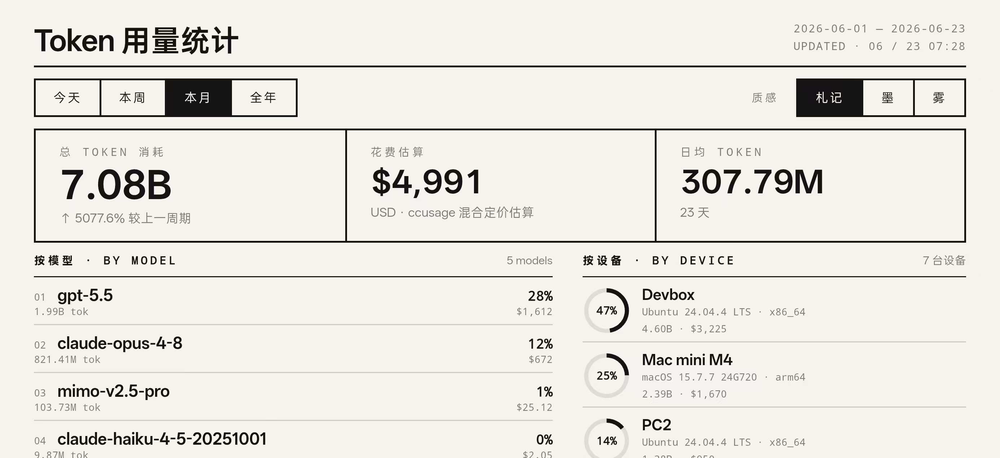
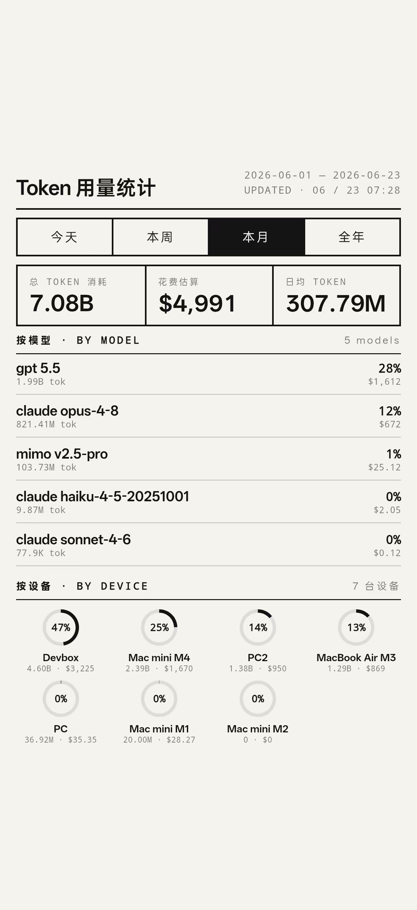
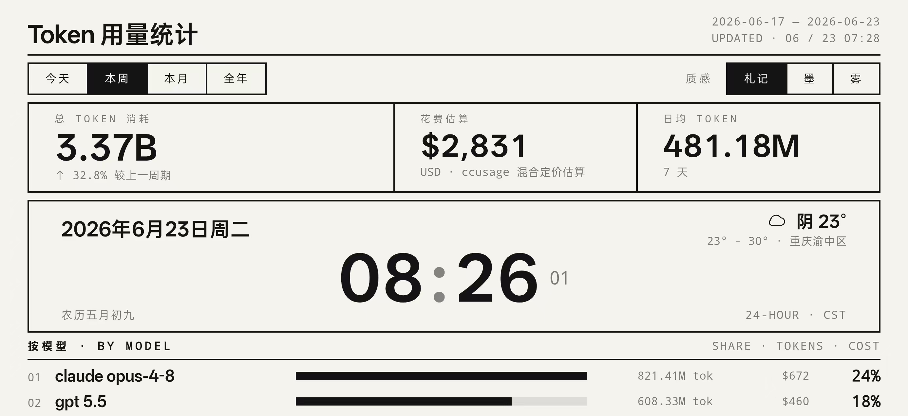
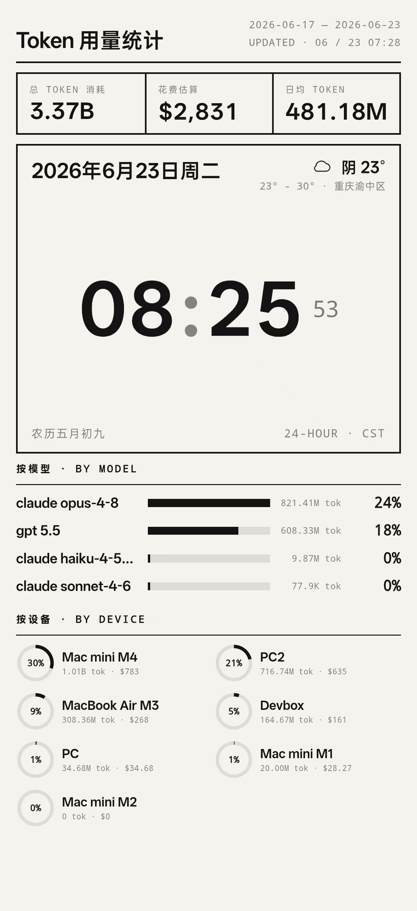

# ccusage-dashboard

[中文](README.md) | [English](README.en.md)

Local-first dashboard for aggregating coding-agent token usage with
[`ccusage`](https://github.com/ryoppippi/ccusage). It can collect data from the
current machine or from SSH-accessible machines, store the result in local
SQLite, and serve two browser dashboards:

- Standard dashboard: `/`
- Clock dashboard: `/clock`

This project does not install background jobs, edit your SSH config, create
services, or configure remote machines for you. Collection is always triggered
manually by the commands below, and all settings live in a local JSON file.

## Preview

### Standard Dashboard

| Landscape | Portrait |
| --- | --- |
|  |  |

### Clock Dashboard

| Landscape | Portrait |
| --- | --- |
|  |  |

## Requirements

- Node.js 18+
- `sqlite3`
- `npx` or `bun` on every machine where collection runs
- SSH access for remote machines, if you use fleet collection

## Install

```sh
git clone git@github.com:leafiy/cc.git
cd cc
cp ccusage.config.example.json ccusage.config.json
```

Edit `ccusage.config.json` for your machines, display names, UI port, and
optional weather provider.

`ccusage.config.json` is ignored by Git. Do not commit API keys, private host
names, private IPs, or generated usage data.

## Configuration

All project settings live in `ccusage.config.json`.

Minimal local-only config:

```json
{
  "timezone": "Asia/Shanghai",
  "ccusagePackage": "ccusage@20.0.14",
  "machine": "local",
  "agents": ["claude", "codex", "opencode", "pi"],
  "nodes": [
    { "id": "local", "label": "Local machine", "mode": "local" }
  ],
  "displayNames": {
    "local": "Local"
  },
  "ui": {
    "host": "0.0.0.0",
    "port": 8765,
    "dashboardDefaultPeriod": "month",
    "clockDefaultPeriod": "week",
    "defaultTheme": "paper",
    "autoSyncMinutes": 10
  },
  "weather": {
    "enabled": false
  }
}
```

Remote node example:

```json
{
  "id": "workstation",
  "label": "Workstation",
  "host": "192.168.1.20",
  "user": "alice",
  "port": 22,
  "piPaths": ["~/.omp/agent"]
}
```

Supported node fields:

- `id`: stable machine key used in SQLite and UI
- `label`: human-readable label for logs
- `mode`: set to `local` for the current machine
- `host`, `user`, `port`: SSH target for remote machines
- `enabled`: set `false` to keep a sample node in config without collecting it
- `piPaths`: extra Oh My Pi/pi-agent roots to pass to `ccusage pi --pi-path`

### Collect the Local Machine by Default

The top-level `collectLocal` defaults to `true`: even if your `nodes` list has
no explicit `local` node, `fleet:sync` (and the built-in timer) automatically
add one so the current machine's usage is always collected. This keeps the host
counted in any multi-machine config.

```json
{
  "collectLocal": true
}
```

Set it to `false` to skip the local machine (e.g. the dashboard runs on a server
with no agents). An explicit `local` node in `nodes` is still honored.

## Get Local Data

Run ccusage on this machine and write JSON snapshots under `data/machines`:

```sh
npm run sync
```

Useful manual filters:

```sh
npm run sync -- --since 2026-06-01
npm run sync -- --until 2026-06-30
npm run sync:offline
npm run sync -- --config ./another-config.json
```

This mode writes legacy JSON files and rebuilds `data/combined/*.json`.

## Get Remote/Fleet Data

Fleet collection runs from the current machine. It SSHes into each enabled node
from `ccusage.config.json`, runs `ccusage` on that node, and stores results in
local SQLite:

```sh
npm run fleet:sync
```

Run only selected nodes:

```sh
npm run fleet:sync -- --node local,workstation
```

Export compatibility JSON as well as SQLite:

```sh
npm run fleet:sync -- --export-json
```

Remote machines must already be reachable non-interactively:

```sh
ssh alice@192.168.1.20
```

Remote machines must also have `npx` or `bun` available in `PATH`. The collector
does not install Node, Bun, SSH keys, shells, or agent tools.

## Data Store

Fleet data is stored locally:

```text
data/ccusage.sqlite
```

The SQLite database stores:

- raw per-machine, per-agent ccusage reports
- machine manifests and OS metadata
- combined daily/monthly totals
- summary markdown
- optional cached weather data

Generated data is ignored by Git.

## Run the UI

```sh
npm run ui:serve
```

Open:

```text
http://localhost:8765/
http://localhost:8765/clock
```

Hidden shortcut: double-click the `Token 用量统计` title in either UI to toggle
browser fullscreen.

If you changed `ui.port`, use that port instead.

## Auto-refreshing Usage

The UI pages already reload on their own (the standard dashboard every 60s, the
clock dashboard every 30 minutes) and read live from SQLite. To keep the data
itself fresh, `ui:serve` ships with a built-in timer that runs `fleet:sync` in
the background on a fixed interval — no system-level cron / launchd / systemd
needed.

Control the interval with `ui.autoSyncMinutes`, default `10` (minutes):

```json
{
  "ui": {
    "autoSyncMinutes": 10
  }
}
```

- Set it to `0` to disable the built-in timer (serve pages only, no auto sync).
- Override it ad hoc with an env var: `CCUSAGE_AUTO_SYNC_MINUTES=30 npm run ui:serve`.
- It syncs once immediately on startup, then repeats on the interval; if the
  previous sync is still running, the tick is skipped (no pile-up).
- A failed sync is logged only and never takes down the UI server.

Keep `npm run ui:serve` running and both collection and display refresh
automatically.

## Optional Weather

The clock view can show QWeather/和风天气. Configure it in JSON:

```json
{
  "weather": {
    "enabled": true,
    "provider": "qweather",
    "apiHost": "your-api-host.re.qweatherapi.com",
    "apiKey": "your-api-key",
    "credentialId": "optional-credential-id",
    "location": "101040100",
    "cityLabel": "重庆",
    "refreshMinutes": 30
  }
}
```

Use 和风 GeoAPI to look up a city or district location ID, then set
`weather.location` to that ID. Weather is fetched server-side and cached in
SQLite; the API key is not exposed to the dashboard HTML.

## Cost Numbers

Cost is the API-equivalent estimate reported by `ccusage` as `costUSD` or
`totalCost`. It is not your real bill and does not account for subscriptions,
bundles, credits, or local/free model usage.

## Publishing

Before pushing an open-source copy, check that only source files and docs are
tracked:

```sh
git status --short
git ls-files data
```

`git ls-files data` should print nothing.
